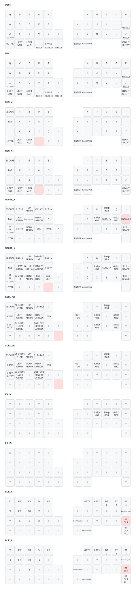

## Keymap



`config/mona2.keymap` の変更を push すると GitHub Actions ([draw-keymaps.yml](.github/workflows/draw-keymaps.yml)) が上図を自動更新します。

## COROPIT

COROPITを使用する方は以下のようにコードを編集してください。

mona2_r.overlay

修正前

```text
  trackball_central: trackball_central@0 {
        status = "okay";
        compatible = "pixart,pmw3610";  //トラボセンサ用のドライバとバインド
        reg = <0>;
        spi-max-frequency = <2000000>;
        irq-gpios = <&gpio0 2 (GPIO_ACTIVE_LOW | GPIO_PULL_UP)>; //P0.02を指定(MOTION)
        cpi = <600>;
        //swap-xy;
        //invert-x; //COROPIT版ではコメントアウトを外す
        //invert-y; //COROPIT版ではコメントアウトを外す
        evt-type = <INPUT_EV_REL>;
        x-input-code = <INPUT_REL_X>;
        y-input-code = <INPUT_REL_Y>;
    };
};

```

**修正後**

```text
  trackball_central: trackball_central@0 {
        status = "okay";
        compatible = "pixart,pmw3610";  //トラボセンサ用のドライバとバインド
        reg = <0>;
        spi-max-frequency = <2000000>;
        irq-gpios = <&gpio0 2 (GPIO_ACTIVE_LOW | GPIO_PULL_UP)>; //P0.02を指定(MOTION)
        cpi = <600>;
        //swap-xy;
        invert-x; //COROPIT版ではコメントアウトを外す
        invert-y; //COROPIT版ではコメントアウトを外す
        evt-type = <INPUT_EV_REL>;
        x-input-code = <INPUT_REL_X>;
        y-input-code = <INPUT_REL_Y>;
    };
};

```
